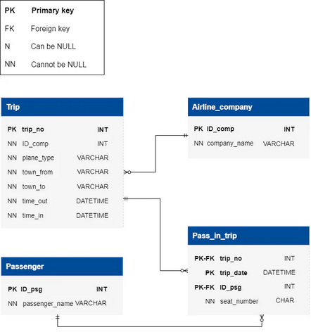

# Stage 6/6: ABC Passenger Segmentation
## Description
In this final stage, the goal is to utilize ABC testing to segment passengers based on their contribution to total income,  
recognizing that certain passengers frequently fly and thus play a substantial role in revenue generation.  
As a data analyst, the objective is to identify these high-contributing passengers by categorizing them as A, B, or C  
based on their cumulative share percentage of total income. By targeting these passengers, airlines can optimize marketing  
strategies and loyalty programs to enhance revenue.

## Objectives
- First, retrieve the `ID_psg` and `passenger_name` from the `Passenger` table. Next, calculate the income in **dollars**  
  generated by each passenger from tables `Pass_in_trip` and `Trip` tables, considering that each **second** of flight  
  contributes **one cent**. Name this value as `passenger_income_dollars`. Then, determine the cumulative share percentage  
  `cumulative_share_percent`.
- The `cumulative_share_percent` shows how much of the total income comes from each passenger's income when you add up  
  passenger income one by one, for example, looking at what percentage of total revenue passengers earn,  
  sorted by their income levels.
- Then you need to identify the passenger `category`. To categorize passengers, group them into three `category`: **A**, **B**, and **C**.  
  Category **A** represents up to **80%** of the `cumulative_share_percent`, category **B** covers from **80.01% to 95%**, and   
  category **C** spans from **95.01% to 100%**.
- `ROUND` the `cumulative_share_percent` up to 2 decimal places.
- Utilize the `JOIN` function effectively to combine multiple tables accurately, and **consider** using the `CASE` conditional  
  function to properly categorize the passengers. Additionally, it is **recommended** to use the `WITH (CTE)` function to  
  efficiently reuse the same subqueries multiple times throughout the query.
- Employ the `GROUP BY` function to effectively group the income of passengers by `ID_psg` and `passenger_name`.
- The column order is essential.

### ChatGPT prompts that help to write the query
- Imagine you have a dataset containing information about passengers, including their IDs and names. How would you  
  formulate an SQL query to retrieve the passenger ID and name from the dataset?
- Now, assuming you have data on passengers' flight details, how would you write an SQL query to calculate the income  
  generated by each passenger, considering that each second of flight contributes to their income?
- In addition to calculating individual passenger incomes, how would you formulate an SQL query to determine the  
  cumulative share percentage of total income earned by passengers, sorted by their income levels?
- Now, thinking about the passenger income distribution, how would you use SQL to categorize passengers into  
  different categories (A, B, C) based on their income levels? Consider using the CASE conditional function for this task.

Take a look at the following database structure:



### Explanation of the database
The **`Airline Transportation Database`** encompasses four main tables: `Airline_Company`, `Trip`, `Passenger`, and `Pass_in_trip`.  
It facilitates the management of airline operations, storing critical information about airline companies, flights,  
passengers, and trip details.

In-depth details of each table are as follows:

`Airline_company`**: Serves as a repository for airline company information, providing a unique identifier for      
each company along with their respective names.
- `ID_comp`: Primary key representing the unique identifier for each airline company.
- `company_name`: Stores the name of the airline company, enabling identification and association with flight operations.

`Trip`**: Contains detailed information about each flight trip.
- `trip_no`: Primary key serving as a unique identifier for each flight trip.
- `ID_comp`: Foreign key referencing the ID_comp in the Airline_Company table, establishing a relationship between flights and airline companies.
- `plane_type`: Records the type of aircraft used for the flight.
- `town_from`: Indicates the departure city of the flight.
- `town_to`: Specifies the arrival city of the flight.
- `time_out`: Stores the departure time of the flight.
- `time_in`: Records the arrival time of the flight.

`Passenger`**: Maintains records of individual passengers.
- `ID_psg`: Primary key representing the unique identifier for each passenger.
- `passenger_name`: Stores the name of the passenger, facilitating passenger identification and management.

`Pass_in_trip`**: Serves as a bridge between passengers and trip details.
- `trip_no`: Foreign key referencing the trip_no in the Trip table, establishing a relationship between passengers and flights.
- `trip_date`: Records the date of the trip, allowing for chronological organization of passenger-trip associations.
- `ID_psg`: Foreign key referencing the ID_psg in the Passenger table, associating passengers with specific trips.
- `seat_number`: Indicates the seat number occupied by the passenger during the trip, providing seating information   
  for passenger tracking and flight organization.

### Additional information and rules to consider:
- flights operate daily, and the flight duration of any flight is less than a day; `town_from` <> `town_to`.
- time and date in the `time_out` and `time_in` are taken into account relative to one-time zone.
- `time_out` and `time_in` times are indicated accurate to the minute.
- `passenger_name` may have namesakes (same name field values).
- the `seat_number` in the cabin is a number with a letter; the number determines the number of the row  
  in the range from 01 to 99, and the letter (a – d) – the place in the row from left to right in alphabetical order.

** _Table names are case-sensitive._

Click on the [Database.sql](Database.sql) to download the SQL query for creating the database.

## Example

_Passenger Table Example:_

| ID_psg | passenger_name |
|--------|----------------|
| 1      | John Smith     |
| 2      | Mary Johnson   |
| 3      | James Williams |

_Pass_in_trip Table Example:_

| trip_no | trip_date           | ID_psg | seat_number |
|---------|---------------------|--------|-------------|
| 1       | 2024-02-23 00:00:00 | 1      | 01A         |
| 1       | 2024-02-23 00:00:00 | 2      | 21B         |
| 3       | 2024-02-28 00:00:00 | 1      | 30D         |
| 2       | 2024-02-25 00:00:00 | 1      | 05C         |
| 3       | 2024-02-28 00:00:00 | 3      | 86A         |
| 2       | 2024-02-25 00:00:00 | 1      | 57C         |

_Trip Table Example:_

| trip_no | ID_comp | plane_type  | town_from | town_to    | time_out            | time_in             |
|---------|---------|-------------|-----------|------------|---------------------|---------------------|
| 1       | 2       | Boeing 737  | Chicago   | Miami      | 2024-02-23 08:00:00 | 2024-02-23 18:45:00 |
| 2       | 2       | Airbus A320 | New York  | Boston     | 2024-02-25 03:30:00 | 2024-02-25 15:20:00 |
| 3       | 2       | Airbus A323 | Denver    | Chicago    | 2024-02-28 05:30:00 | 2024-02-25 09:00:00 |

From the given data, we observe that for `trip_no`: `1`,` 2`, and `3`, the flight durations are **645**, **710**, and **210 minutes**, respectively.  
These trips generate incomes as follows:  
1. 645 ∗ 60 ∗ 0.01 = 387$
2. 710 ∗ 60 ∗ 0.01 = 426$
3. 210 ∗ 60 ∗ 0.01 = 126$  

Let's find out how much income each passenger(`passenger_income_dollars`) with `ID_psg`: `1`, `2`, and `3` generated based on  
their `trip_no` recorded in the `Pass_in_trip` table:  
1. 387 ∗ 1 + 426 ∗ 2 + 126 ∗ 1 = 1365$
2. 387 ∗ 1 + 426 ∗ 0 + 126 ∗ 0 = 387$
3. 387 ∗ 0 + 710 ∗ 0 + 126 ∗ 1 = 126$

In total the income which was generated is equal to:  
1365 + 387 + 126 = 1878$

Finally, let's calculate the `cumulative_share_percent` of each passenger:  
1. 1365 / 1878 = 72.68%
2. 387 / 1878 = 20.61%
3. 126 / 1878 = 6.71%

After the sorting according to descending order, the final values of `cumulative_share_percent` are:  
1. 72.68%
2. 72.68 + 20.61 = 93.29%
3. 93.29 + 6.71 = 100.00%

Based on the above calculation, the passenger with `ID_psg`: `1` is in category `A`, the passenger with `ID_psg`: `2` is in category `B`,  
and the passenger with `ID_psg`: `3` is in category `C`.

Final output after identifying the `ID_psg`, `passenger_name`, with `correspondingpassenger_income_dollars`, `cumulative_share_percent`, `category`:

| ID_psg | passenger_name | passenger_income_dollars | cumulative_share_percent | category |
|--------|----------------|--------------------------|--------------------------|----------|
| 1      | John Smith     | 1365                     | 72.68                    | A        |
| 2      | Mary Johnson   | 387                      | 93.29                    | B        |
| 3      | James Williams | 126                      | 100                      | C        |

_From the output above, it can be seen that the order of the columns is:  
`ID_psg` -> `passenger_name`-> `passenger_income_dollars` -> `cumulative_share_percent` -> `category`_

## Query template:
```markdown
WITH PassengerIncome AS (
    SELECT 
        p.ID_psg,
        p.passenger_name, ...;
```